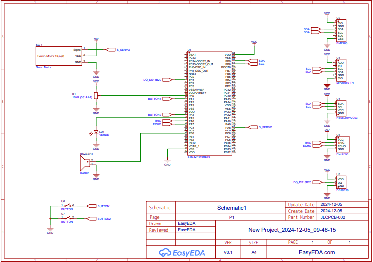

# Projeto Sistemas Embarcados VIRTUS-CC

Este documento descreve as funções implementadas no projeto para a integração de sensores e controle de dispositivos utilizando uma MCU STM32 e os periféricos associados.

## Requerimentos para o projeto

- 1x STM32 F446RE
- 1x Giroscópio/Acelerômetro MPU6050
- 1x Temperatura/Pressão BMP280
- 1x Sensor Ultrassônico HCSR04
- 1x Servo Motor SG-90
- 1x Buzzer
- 1x Display Oled HS96L03W2C03
- 2x Botão

## Portas utilizadas na STM32 pelos sensores e atuadores

- **MPU6050 (I2C)**
  - SDA - GPIO PIN PB7
  - SCL - GPIO PIN PB6
- **BMP280 (I2C)**
  - SDA - GPIO PIN PB7
  - SCL - GPIO PIN PB6
- **Ultrassônico HCSR04**
  - TRIG - GPIO PIN PA6
  - ECHO - GPIO PIN PA7
- **Servo Motor (PWM)**
  - Controle - GPIO PIN PA8 (TIM1_CH1)
- **Buzzer (PWM)**
  - Controle - GPIO PIN PB0 (TIM3_CH3)
- **Botões 1 e 2**
  - GPIO PIN PA1 e PA4

## Funções Implementadas no `main.c`

### `void modules_init(void)`

**Descrição**:\
Inicializa os módulos utilizados no projeto, incluindo sensores (MPU6050, BMP280, ultrassônico), display OLED e atuadores (servo motor e buzzer).

**Por que é feito**:\
Essa função é responsável por garantir que todos os módulos estejam configurados e prontos para uso.

---

### `void lcd_write_mpu(void)`

**Descrição**:\
Exibe no display OLED os dados lidos do MPU6050, como ângulos calculados e acelerações nos eixos X, Y e Z.

**Por que é feito**:\
Permite visualizar as informações de orientação e movimento em tempo real.

---

### `void lcd_write_bmp(void)`

**Descrição**:\
Exibe no display OLED os dados do sensor BMP280, como pressão, temperatura e altitude calculada.

**Por que é feito**:\
Fornece informações ambientais em tempo real no display.

---

### `void HCSR04_Read(void)`

**Descrição**:\
Realiza a leitura do sensor ultrassônico HCSR04, calculando a distância até o objeto mais próximo.

**Por que é feito**:\
Para integrar medidas de distância no controle de atuadores, como o buzzer.

---

### `void servo_motor(uint16_t step)`

**Descrição**:\
Controla o ângulo do servo motor ajustando o sinal PWM.

**Parâmetros**:
- `step` - Valor de duty cycle do PWM, correspondente ao ângulo desejado.

**Por que é feito**:\
Movimenta o servo motor para posições específicas com base nos dados de sensores.

---

### `void buzzer(uint16_t duty)`

**Descrição**:\
Ajusta a intensidade do buzzer proporcionalmente à distância medida pelo HCSR04.

**Parâmetros**:
- `duty` - Intensidade do sinal PWM para o buzzer.

**Por que é feito**:\
Alerta o usuário de objetos próximos com intensidade variável.

## Funções Implementadas no `mpu6050.c`

### `uint8_t MPU6050_Init(I2C_HandleTypeDef *hi2c)`

**Descrição**:\
Inicializa o sensor MPU6050, configurando os registradores para medições de aceleração e giroscópio.

**Parâmetros**:
- `hi2c` - Ponteiro para a interface I2C utilizada.

**Retorno**:
- `0` - Inicialização bem-sucedida.
- `1` - Falha na inicialização.

**Por que é feito**:\
Garante que o sensor esteja operacional para leituras subsequentes.

---

### `void MPU6050_Read_Accel(I2C_HandleTypeDef *hi2c, MPU6050_t *DataStruct)`

**Descrição**:\
Lê os valores brutos de aceleração e os converte para unidades de gravidade.

**Parâmetros**:
- `hi2c` - Ponteiro para a interface I2C utilizada.
- `DataStruct` - Estrutura para armazenar os dados lidos.

**Por que é feito**:\
Obtém informações sobre a aceleração nos três eixos.

---

### `void MPU6050_Read_Gyro(I2C_HandleTypeDef *hi2c, MPU6050_t *DataStruct)`

**Descrição**:\
Lê os valores brutos do giroscópio e os converte para graus por segundo.

**Parâmetros**:
- `hi2c` - Ponteiro para a interface I2C utilizada.
- `DataStruct` - Estrutura para armazenar os dados lidos.

**Por que é feito**:\
Mede a velocidade angular do dispositivo.

---

### `void MPU6050_Read_All(I2C_HandleTypeDef *hi2c, MPU6050_t *DataStruct)`

**Descrição**:\
Realiza leituras completas do sensor, incluindo aceleração, giroscópio e temperatura. Também calcula ângulos de rotação com o filtro de Kalman.

**Parâmetros**:
- `hi2c` - Ponteiro para a interface I2C utilizada.
- `DataStruct` - Estrutura para armazenar os dados lidos.

**Por que é feito**:\
Fornece um conjunto completo de informações de movimento e orientação em uma única operação.

---

### `double Kalman_getAngle(Kalman_t *Kalman, double newAngle, double newRate, double dt)`

**Descrição**:\
Calcula um ângulo suavizado com base em leituras de sensores e um filtro de Kalman.

**Parâmetros**:
- `Kalman` - Estrutura contendo os parâmetros do filtro de Kalman.
- `newAngle` - Novo ângulo medido.
- `newRate` - Nova taxa de variação angular.
- `dt` - Intervalo de tempo desde a última medição.

**Retorno**:
- Ângulo suavizado calculado.

**Por que é feito**:\
Reduz ruídos nas medições de ângulos, garantindo maior precisão nos cálculos de orientação.

## Funções Implementadas no `bmp280.h`

### `void bmp280_init_default_params(bmp280_params_t *params)`

**Descrição**:\
Inicializa a estrutura de parâmetros com valores padrão para o BMP280.

**Por que é feito**:\
Simplifica a configuração inicial do sensor, garantindo operação consistente.

---

### `bool bmp280_init(BMP280_HandleTypedef *dev, bmp280_params_t *params)`

**Descrição**:\
Inicializa o sensor BMP280, configura os registradores e lê as constantes de calibração.

**Parâmetros**:
- `dev` - Estrutura do dispositivo contendo informações do sensor.
- `params` - Estrutura com os parâmetros de configuração.

**Retorno**:
- `true` - Inicialização bem-sucedida.
- `false` - Falha na inicialização.

**Por que é feito**:\
Garante que o sensor esteja configurado corretamente antes das leituras.

---

### `bool bmp280_read_float(BMP280_HandleTypedef *dev, float *temperature, float *pressure, float *humidity, float *altitude)`

**Descrição**:\
Lê os dados de temperatura, pressão, umidade (opcional) e altitude calculada.

**Parâmetros**:
- `dev` - Estrutura do dispositivo contendo informações do sensor.
- `temperature` - Ponteiro para armazenar a temperatura lida.
- `pressure` - Ponteiro para armazenar a pressão lida.
- `humidity` - Ponteiro para armazenar a umidade lida (apenas BME280).
- `altitude` - Ponteiro para armazenar a altitude calculada.

**Retorno**:
- `true` - Leitura bem-sucedida.
- `false` - Falha na leitura.

**Por que é feito**:\
Fornece dados ambientais precisos para análise em tempo real.

## Funções Relacionadas ao Display OLED

### `uint8_t SSD1306_Init(void)`

**Descrição**:\
Inicializa o display OLED SSD1306 e verifica se está pronto para uso.

**Retorno**:
- `0` - O display não foi detectado.
- `> 0` - O display foi inicializado corretamente.

**Por que é feito**:\
Garante que o display esteja configurado para exibição de dados.

---

### `void SSD1306_UpdateScreen(void)`

**Descrição**:\
Atualiza o buffer interno para refletir as mudanças na tela do display.

**Por que é feito**:\
Aplica as alterações feitas no conteúdo da tela em tempo real.

---

### `void SSD1306_DrawPixel(uint16_t x, uint16_t y, SSD1306_COLOR_t color)`

**Descrição**:\
Desenha um pixel na posição especificada.

**Parâmetros**:
- `x` - Coordenada X (0 a SSD1306_WIDTH - 1).
- `y` - Coordenada Y (0 a SSD1306_HEIGHT - 1).
- `color` - Cor do pixel (preto ou branco).

**Por que é feito**:\
Permite a criação de gráficos e desenhos personalizados na tela.

---

### `void SSD1306_DrawBitmap(int16_t x, int16_t y, const unsigned char* bitmap, int16_t w, int16_t h, uint16_t color)`

**Descrição**:\
Desenha um bitmap na posição especificada.

**Parâmetros**:
- `x`, `y` - Coordenadas iniciais.
- `bitmap` - Ponteiro para os dados do bitmap.
- `w`, `h` - Largura e altura do bitmap.
- `color` - Cor do desenho.

**Por que é feito**:\
Facilita a exibição de imagens ou logos personalizados.

---

### `void SSD1306_Clear(void)`

**Descrição**:\
Limpa todo o conteúdo exibido no display.

**Por que é feito**:\
Garante que a tela esteja vazia antes de novas exibições.

---

### `void SSD1306_ScrollRight(uint8_t start_row, uint8_t end_row)`

**Descrição**:\
Inicia a rolagem horizontal para a direita em linhas específicas.

**Parâmetros**:
- `start_row`, `end_row` - Linhas onde a rolagem será aplicada.

**Por que é feito**:\
Permite criar efeitos visuais ou destacar informações na tela.

## Esquemático

## Autores

- [Antonio Roberto](https://github.com/antoniojunior2222)
- [Ismael Marinho](https://github.com/smalljooj)
